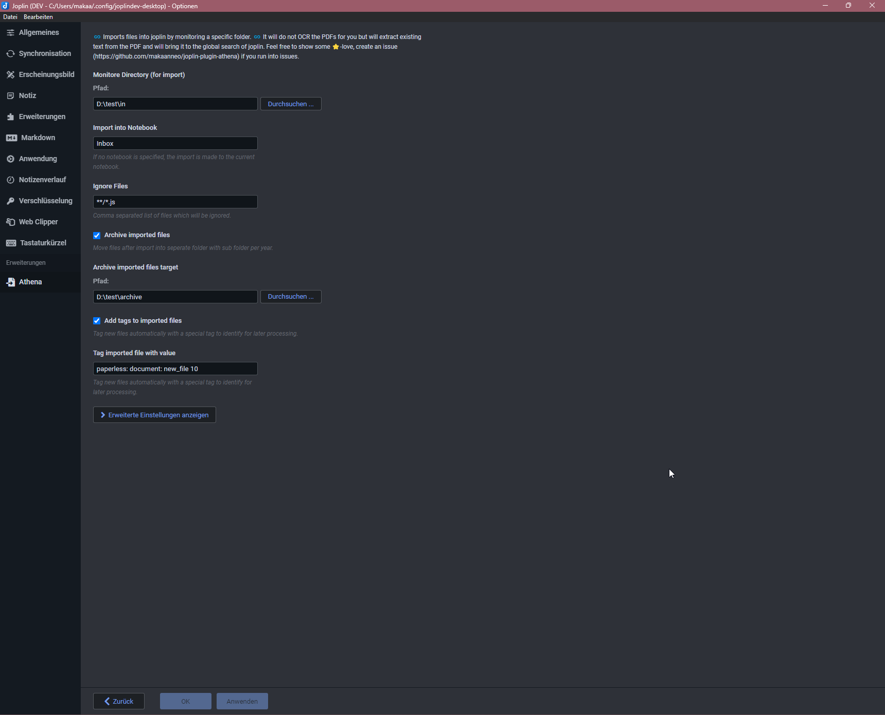
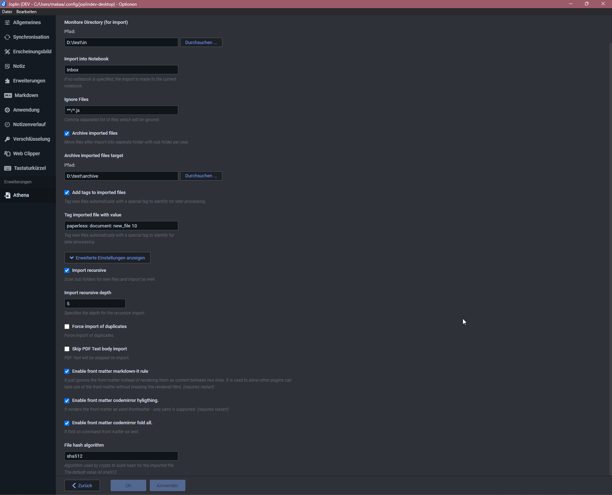
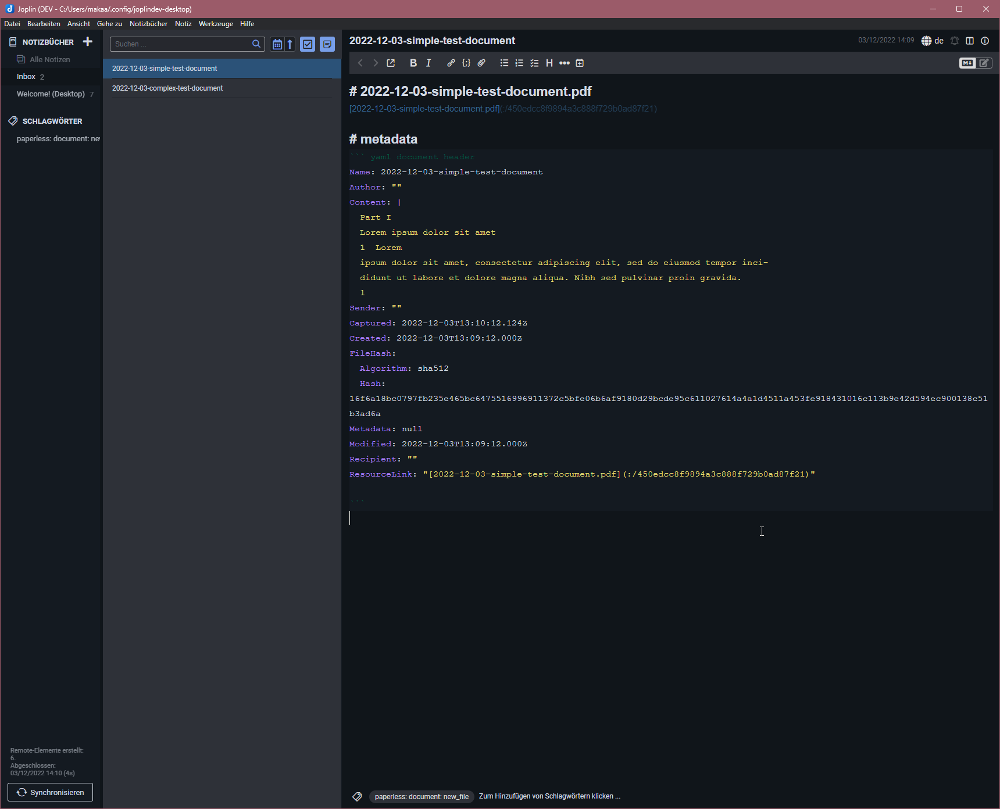

# Athena

> new Version

[](https://github.com/makaanneo/joplin-plugin-athena/actions/workflows/ci.yml)

Athena is an open-source plugin. You can use the plugin to manage your PDFs with the power of Joplin and cary all your documents inside your pocket.

The plugin in currently under development and in beta stage. You can specify a folder and start importing files from this folder into your joplin notebooks. For PDFs it will extract the text inside the pdf and place it as a comment inside of the note.

Due to the fact that the PDF text and metadata are stored inside the note they as well available on all platforms.

## Usage

Fill in the required values for the options.
### regular options

### advanced options

And copy PDF files inside the import path to start working.

## How it works
These plugin imort files from certain folders, specified inside the settings. For pdf files it will extract some meta data if there as well as text stored inside the pdf (OCR must be done by the scanner application) and stores the text inside a yaml code block of the note itself.


## Format in Note
The format of importat files is:

``` markdown
# 2022-12-03-simple-test-document.pdf
[2022-12-03-simple-test-document.pdf](:/450edcc8f9894a3c888f729b0ad87f21)

# metadata
```
````
``` yaml document header
Name: 2022-12-03-simple-test-document
Author: ""
Content: |
  Part I
  Lorem ipsum dolor sit amet
  1  Lorem
  ipsum dolor sit amet, consectetur adipiscing elit, sed do eiusmod tempor inci-
  didunt ut labore et dolore magna aliqua. Nibh sed pulvinar proin gravida.
  1
Sender: ""
Captured: 2022-12-03T13:10:12.124Z
Created: 2022-12-03T13:09:12.000Z
FileHash:
  Algorithm: sha512
  Hash: 16f6a18bc0797fb235e465bc6475516996911372c5bfe06b6af9180d29bcde95c611027614a4a1d4511a453fe918431016c113b9e42d594ec900138c51b3ad6a
Metadata: null
Modified: 2022-12-03T13:09:12.000Z
Recipient: ""
ResourceLink: "[2022-12-03-simple-test-document.pdf](:/450edcc8f9894a3c888f729b0ad87f21)"

```
````

## Old style (deprecated)
The old style can be migrated by a command by selecting multiple notes.
```xml
<!--
PDFMETADATATEXTSTART
CreationDate: 2022-01-01T11:11:11.000Z

PDFMETADATATEXTEND
PDFCONTENTTEXTSTART
some text
PDFCONTENTTEXTEND
FILEHASHSTART
FILEHASHEND
-->
<!--
FILEHASHSTART
d99111f398d7e3lot0481ce53748ac6e095f6700610f5601900d6f1edb563553b0df463dd325abe4e41d278a849658f087b2b1246fkdbaea5c9acac05d59cd78d59
FILEHASHEND
-->
```

### duplication detection
The import handels as well duplicates before the file will be imported into joplin. For this the file is loaded and a SHA256 hashcode will be calculated and looked up if there is any note with the same filehash in comments.

## Further imporvements
For the time being the meta data of files is stored inside the note as comment blocks. May it could be stored somewhere in the future somewhere else.

## Roadmap

- [ ] Show import status in a status bar with progress
- [ ] Improve tag handling on import (will be moved to other plugin)
- [ ] Integrate OCR
- [ ] and a lot more

## Misc

This plugin is still in beta phase.

Any PR / Issue / Discussion is welcome!

## License

[MIT](LICENSE.md)

## Thanks

Basically, this plugin is inspired by:

- [Resource Search Plugin](https://github.com/roman-r-m/joplin-plugin-resource-search)
- [Hotfolder](https://github.com/JackGruber/joplin-plugin-hotfolder)
- [Enhancement](https://github.com/SeptemberHX/joplin-plugin-enhancement)
- [Folding in Code Mirror Editor](https://github.com/ambrt/joplin-plugin-fold-cm)
- [Zettlr](https://www.zettlr.com/)

## Development

During my development I decided to upgrade webpack to the latest version. The webpack config is changed heaviely.
and [how to build](GENERATOR_DOC.md)

### webpack

For this plugin webpack is updated to version 5. the [webpackconfig](webpack.config.js) is configured accordingly.
